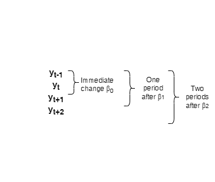
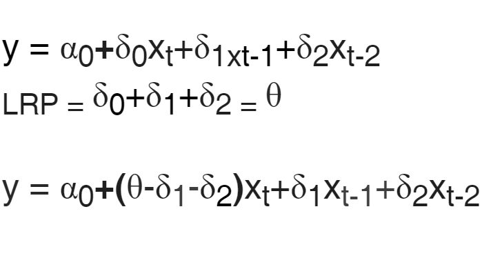

# Time Series

Most of the notes here come from @wooldridge1996introductory.

Applying OLS method to time series requieres special attention.

Often, these models violate the Gauss-Markov assumptions.

We can no longer assume random sampling. According to Nicola Riguetti (@), a characteristic of time series is that past events have influence on future behaviors, meaning there is a dependency among the data points. Correlation in the data violates assumptions of traditional statistical approaches, that when are implemented in time series give mistrusted results. 
Specific statistical methodologies have been developed to deal with data dependend on time.

## Characteristics

In time series, there is temporal ordering. That means the past can affect the future, but not the other way round. 

The observed data is only one possible outcome of the `r ifelse(knitr::is_html_output(), print("<key>stochastic process</key>"), print("\\key{stochastic process}"))`. These is also called *realizations* of the time series process. It is not possible to observe other value, since history cannot be changed. However, the existance of an `r ifelse(knitr::is_html_output(), print("<key>stochastic process</key>"), print("\\key{stochastic process}"))` suggest that if events had been different, a different *realization* would have been obtained. That is why time series can be think of as the outcome of random variables.

All possible realizations of an `r ifelse(knitr::is_html_output(), print("<key>stochastic process</key>"), print("\\key{stochastic process}"))` are the total population in cross-sectional data, while the sample size is the number of periods over the observed variables.


## Static models

All variables are dated contemporaneously:

$$y_i = \beta_0 + \beta_1x_t + u_t \text{, t = 1,2,...,n}$$

This kind of model is used if it is believed that $x$ has an immediate effect on $y$.

## Finite Distributed Lag Models (FDL)

Some variables are allowed to affect $y$ with a lag.

\begin{equation}
y_t=\alpha+\beta_0x_t+\beta_1x_{t-1}+\beta_2x_{t-2}+u_t
(\#eq:FDL2)
\end{equation} 

Equation \@ref(eq:FDL2) is an FDL of order two, since the lags of the $x$ variable are included from two periods before.

### Temporal increase

Imagine $x$ increases in one unit at time $t$, but goes back to its previos value after and the stochastic process is described as in Equation \@ref(eq:FDL2).

$\beta_0$ is the immediate change in $y_t$ due to a temporal increase of one unit in $x$. All happening at time $t$. ($y_t-y_{t-1}=\beta_0$, assuming $x$ is a constant (ceteris paribus) in every period except in $t$, where it is $x+1$).

$\beta_0$ can be called the `r ifelse(knitr::is_html_output(), print("<key>impact multiplier</key>"), print("\\key{impact multiplier}"))`. It is the change $y$ one period after the change.

$\beta_2$ is the change in $y$ two periods after the change, as figure \@ref(fig:changes) implies. However, as lags from three periods ago were not included, at time $t+3$, $y$ has reverted back to its initial level of all constants. Remember this was just a temporary increase.

```{r changes, fig.cap='Laged parameters', fig.width=10}



```

### Permanent increase

This time, $x$ will change at period $t$, without going back to its previos value.

The immediate change in this situation is the same as in the temporal increase. Things change for periods greater than $t$. Considering Equation \@ref(eq:FDL2), after one period, $y$ is going to increase $\beta_0+\beta_1$ and $\beta+0+\beta_1+\beta_2$ after two periods. Considering it is a second order FDL, there are no further changes after two periods. Then, that makes $\beta+0+\beta_1+\beta_2$ the `r ifelse(knitr::is_html_output(), print("<key>long-run multiplier</key>"), print("\\key{long-run multiplier}"))`.

For a horizon $h$, the `r ifelse(knitr::is_html_output(), print("<key>cumulative effect</key>"), print("\\key{cumulative effect}"))` can be defined as the sum of the coefficients: $\beta_0+\beta_1+\beta_2+...+\beta_h$. It is the expected change in the outcome after $h$ periods after a permanent change in one unit increase in $x$.

Correlation between the $x$ and its lag values is expected (implying multicollinearity) it can be challenging to get accurate estimates of each $\beta$ parameter.

## OLS properties

If assumptions explaned in sections \@ref(t1), \@ref(t2), \@ref(t3), \@ref(t4) and \@ref(t5) of the Gauss-Markov theorem, we have that:

1. The variance of $\hat{\beta_j}$ conditional on X is

$$Var(\hat{\beta_j}|X = \frac{\sigma^2}{SST_j(1-R_j^2)}), j=1,...,k$$

$SST_j$ is the total sum of squares of $x_{tj}$ and $R^2_j$ is the R-squared from the regression of $x_j$ on the other independent variables.

2. $\hat{\sigma^2}=\frac{SSR}{n-k-1}$ is an unbiased estimator of $\hat{\sigma^2}$

And then, the OLS estimators are the best linear unbiased estimators (BLUE) conditional on X.

In order to make inference towards OLS estimators, section \@ref(t6) explains the assumption required.

All six assumptions make the Classical Linear Model assumptions for time series, were the OLS estimators are normally distributed, conditional to X. $t$ statistic has a $t$ distribution and each $F$ statistic has an $F$ distribution.

### Unbiased estimators

$$E(\hat{\beta_j}) = \beta_j$$

The expected value of the estimated parameter is the actual parameter.

#### Linear Parameters {#t1}

The time series follows a model that is linear in its parameters:

$$y_t = \beta_0 + \beta_1x_t+...+\beta_kx_{tk}+u_t$$

#### No perfect Collinearity {#t2}

No independent variable is constant nor a perfect linear combination of the others.

#### Zero conditional mean {#t3}

For each $t$, the expected value of the error $u_t$ given the explanatory variables for all time periods, is zero.

$$E(u_t|X) = 0,\text{ t}=1,2,...,n$$

The above meaning the error term and the independent variables are not correlated in any time period.

If the expected value of the error given the X's in a time $t$ is zero, this implies the X's are `r ifelse(knitr::is_html_output(), print("<key>contemporaneously exogenous</key>"), print("\\key{contemporaneously exogenous}"))`.

When the expected value of the error given the X's is zero for all $t$, that implies the X's are  `r ifelse(knitr::is_html_output(), print("<key>strictly exogenous</key>"), print("\\key{strictly exogenous}"))`.

This also means there is no restriction on correlation in the independent variables or the errors accross time.

In practice, holding strict exogeneity can be unrealistic.

### Minimum variance of estimators

#### Homoskedasticity {#t4}

The conditional variance of the error term given X is constant.

$$Var(u_t|X)=Var(u_t)$$

If this doesn't hold, the errors are heteroskedastic.

#### No serial Correlation {#t5}

The autocorrelation of the error conditional to X is zero for all different t.

$$Corr(u_t, u_s|X)=0, \text{ for all} t \neq s$$

When this false, the errors are `r ifelse(knitr::is_html_output(), print("<key>autocorrelated</key>"), print("\\key{autocorrelated}"))`.

The presence of `r ifelse(knitr::is_html_output(), print("<key>autocorrelation</key>"), print("\\key{autocorrelation}"))` in the errors means that if $y$ is unexpectedly high for this period, then it is likely to be above average in the next period too. In many applications, this is reasonable to assume.

### Inference

#### Normality {#t6}

The errors are independent of X and are independently and identically distributed as Normal(0,$\sigma^2$).

This implies assumptions in sections \@ref(t3), \@ref(t4) and \@ref(t5), but stronger.

## Functional forms

Natural logarithms are often used in time series regressions with constant percentage effects.

If the model is a log-log, then the coefficient can be interpreted as the elasticity of $y$ with respect to $x$.

Logartihms can be used in lag models. In a log-log, the `r ifelse(knitr::is_html_output(), print("<key>impact multiplier</key>"), print("\\key{impact multiplier}"))` $\beta_0$ is called `r ifelse(knitr::is_html_output(), print("<key>short-run elasticity</key>"), print("\\key{short-run elasticity}"))`. The `r ifelse(knitr::is_html_output(), print("<key>cumulative effect</key>"), print("\\key{cumulative effect}"))` is sometimes called `r ifelse(knitr::is_html_output(), print("<key>long-run elasticity, LRP</key>"), print("\\key{long-run elasticity, LRP}"))`, and measures the percentage increase in $y$ after $k$ periods, given a permanent increase of 1\% in $x$.

When a lag of a variable is added to the model, we loose one observation. The lagged variables can be substantially correlated, creating a multicollinearity problem that makes difficult to estimate the effect of each lag. The joint significance given by the $F$ statistic tells if the variable is significant. However, it doesn't point out if it is the contemporaneous, a lagged one or all. Regressing the model using the LRP makes possible to estimate the standard error of the LRP estimate and determine if it is statistically different from zero, eventhough none of the coefficients is individually significant (refer to @wooldridge1996introductory, page 347).


```{r LRP, fig.cap='LRP estimation, example', fig.width=10}



```

Indexed variables are helpful in time series analysis, as in allows to make interpretations about magnitudes. CPI is an example. For the base year, the CPI takes the value of 1, as it can be measured as the division between the year value and the base value (in this case, it is the same). Variables like price indexes are useful to turn nominal variables (includes inflation. Changes in nominal variables are due to changes in prices and productivity) into real variables (inflation not included. Changes here are due to productivity only).

Remeber: The significance of the coefficients can be interpreted using the standard error. If the coefficient's absolute value is greater than two times the standard error, it is significant

## Trends in time series

### Linear trends

Economic series like population have the tendency of growing over time. Ignoring a `r ifelse(knitr::is_html_output(), print("<key>time trend</key>"), print("\\key{time trend}"))` can lead to believe two series are related, in a direct or indirect way, when those changes can be uncorrelated. In many cases, two time series processes appear to be correlated only because they have the same trend over time. 

Trending behavior can be capture like:

$$y_t = \alpha_0 + \alpha_1t + e_t, t=1,2...,$$

- where $e_t$ is an i.i.d sequence with expected value equal to zero and constant variance.
- $\alpha_1$ is the change in $y$ from one period to the next one due to time. If positive, $y_t$ is growing over time and has an upward trend. If negative, the serie has a downward trend.
- The variance of $y_t$ is constant accross time. 

### Exponential trends


On the contrary of linear trends, an exponential trend is present when the time series have a constant growth over time. It can be captured using:

\begin{equation}
log(y_t)=\beta_0+\beta_1t+e_t, t=1,2...
(\#eq:etrend)
\end{equation} 


- $\beta_1$ can be interpreted as the growth rate in $y$ from period $t-1$ to period $t$, considering Equation \@ref(eq:delty)

\begin{eqnarray}
\Delta log(y_t) &\approx& \frac{y_t-y_{t-1}}{y_{t-1}} \\
\Delta log(y_t) &=& \beta_1
(\#eq:delty)
\end{eqnarray}

- $y$ grows about $\beta_1\times 100$ \% per year on average. 

### Other trends

More complicated trends can be modeled using other forms. The derivative of $y$ with respect to $t$ will show the approximate slope. 

An increasing trend followed by a decreasing trend can be modeled like in Equation \@ref(eq:othery), were the trend shape depends on the coefficient values.

\begin{eqnarray}
y_t &=& \alpha_0 + \alpha_1t + \alpha_2t + e_t \\
\frac{\Delta y_t}{\Delta t} &\approx& \alpha_1 + 2\alpha_2t
(\#eq:othery)
\end{eqnarray}


### Regression analysis with trends

The presence of trends do not necessarily violates the classical linear model assumptions discussed in sections \@ref(t1), \@ref(t2), \@ref(t3), \@ref(t4) \@ref(t5) and \@ref(t6). However, the unobserved trending factors affecting $y_t$ might also be correlated with the $x$ variables, creating the `r ifelse(knitr::is_html_output(), print("<key>spurious correlation problem</key>"), print("\\key{spurious correlation problem}"))` that can be solved later adding a time trend.

A model that captures a time trend is displayed in Equation \@ref(eq:spur). Adding the trend is recognizing that $y$ may be growing or shrinking over time for reasons unrelated to the $x$`s.

\begin{eqnarray}
y_t &=& \beta_0 + \beta_1x_{t1} + \beta_2x_{t2} + \beta_3t + u_t
(\#eq:spur)
\end{eqnarray}

The regression of a variable on $t$  tend to contain substantial serial correlation, making the standard errors  not reliable.

In cases when $y$ exhibit both upward and downward trends, the robustnest of the coefficients of the $x$`s included can be seen adding a quadratic trend.

Adding the trend as in Equation \@ref(eq:spur) is called `r ifelse(knitr::is_html_output(), print("<key>detrending</key>"), print("\\key{detrending}"))`. Including the trend, even it is not noticeable in $y$, captures the effects that other variables affected with the trend have.